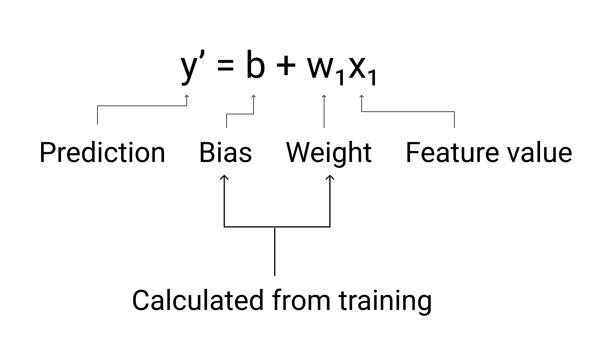

# markdownn maths cheatsheet
[Cheat Sheet: Adding Math Notation to Markdown](https://www.upyesp.org/posts/makrdown-vscode-math-notation/#:~:text=Including%20Math%20Notation%20in%20Markdown&text=Inline%20math%20notation%20is%20wrapped,signs%2C%20wrapped%20inside%20triple%20backticks.)


# account & docs
ACCOUNT: heidlessemail09@gmail.com

Google Group Name: 'ml-crash'

# conda
```
conda config --show channels

conda deactivate

conda remove --all -n cloud_run_0 

conda config --add channels conda-forge

export ML_ENV=ml-crash
conda create --name ${ML_ENV} pip python=3.11
source ~/miniconda3/bin/activate ml-crash

conda env list
conda install jupyterlab --channel conda-forge
pip install icecream --channel conda-forge

#################################
conda install tensorflow=2.15 --channel conda-forge
conda install tensorflow-hub=0.16.1 --channel conda-forge
conda install icecream --channel conda-forge

conda env create -f environment.yml

```

# [Machine Learning Crash Course](https://developers.google.com/machine-learning/crash-course)

## [Introduction to Machine Learning](https://developers.google.com/machine-learning/intro-to-ml)
In basic terms, ML is the process of training a piece of software, called a model, to make useful predictions or generate content from data.

For example, suppose we wanted to create an app to predict rainfall. We could use either a traditional approach or an ML approach. Using a traditional approach, we'd create a physics-based representation of the Earth's atmosphere and surface, computing massive amounts of fluid dynamics equations. This is incredibly difficult.

Using an ML approach, we would give an ML model enormous amounts of weather data until the ML model eventually learned the mathematical relationship between weather patterns that produce differing amounts of rain. We would then give the model the current weather data, and it would predict the amount of rain.

### Types of ML Systems
ML systems fall into one or more of the following categories based on how they learn to make predictions or generate content:

- Supervised learning
- Unsupervised learning
- Reinforcement learning
- Generative AI

### Supervised learning
Supervised learning models can make predictions after seeing lots of data with the correct answers and then discovering the connections between the elements in the data that produce the correct answers.

These ML systems are "supervised" in the sense that a human gives the ML system data with the known correct results.

Two of the most common use cases for supervised learning are **regression** and **classification**.

#### Regression
A regression model predicts a numeric value. For example, a weather model that predicts the amount of rain, in inches or millimeters, is a regression model.

#### Classification
Classification models predict the likelihood that something belongs to a category. 

Unlike regression models, whose output is a number, classification models output a value that states whether or not something belongs to a particular category. 

For example, classification models are used to predict if an email is spam or if a photo contains a cat.

Classification models are divided into two groups: **binary** classification and **multiclass** classification.

 - Binary classification models:
   - output a value from a class that contains only two values, for example, a model that outputs either rain or no rain. 
 - Multiclass classification models:
   -  output a value from a class that contains more than two values, for example, a model that can output either rain, hail, snow, or sleet.

### Unsupervised learning

**Unsupervised** learning models make predictions by being given data that does not contain any correct answers. 

An unsupervised learning model's goal is to identify meaningful patterns among the data. 

In other words, the model has no hints on how to categorize each piece of data, but instead it must infer its own rules.

A commonly used unsupervised learning model employs a technique called **clustering**. The model finds data points that demarcate natural groupings.

Clustering differs from classification because the categories aren't defined by you. 

For example, an unsupervised model might cluster a weather dataset based on temperature, revealing segmentations that define the seasons. 

You might then attempt to name those clusters based on your understanding of the dataset.

### Reinforcement learning

**Reinforcement** learning models make predictions by getting rewards or penalties based on actions performed within an environment. 

A reinforcement learning system generates a policy that defines the best strategy for getting the most rewards.

Reinforcement learning is used to train robots to perform tasks, like walking around a room, and software programs like AlphaGo to play the game of Go.

### [Generative AI](https://developers.google.com/machine-learning/intro-to-ml/what-is-ml#generative_ai)

To produce unique and creative outputs, generative models are initially trained using an unsupervised approach, where the model learns to mimic the data it's trained on. The model is sometimes trained further using supervised or reinforcement learning on specific data related to tasks the model might be asked to perform, for example, summarize an article or edit a photo.

Generative AI is a quickly evolving technology with new use cases constantly being discovered. For example, generative models are helping businesses refine their ecommerce product images by automatically removing distracting backgrounds or improving the quality of low-resolution images.

## Supervised Learning
Supervised learning's tasks are well-defined and can be applied to a multitude of scenarios—like identifying spam or predicting precipitation.

### [Foundational supervised learning concepts](https://developers.google.com/machine-learning/intro-to-ml/supervised#foundational_supervised_learning_concepts)

Supervised machine learning is based on the following core concepts:

- Data
- Model
- Training
- Evaluating
- Inference

#### [Data](https://developers.google.com/machine-learning/intro-to-ml/supervised#data)
Datasets are made up of individual examples that contain features and a label. 

You could think of an **example** as analogous to a single row in a spreadsheet. 

Features are the values that a supervised model uses to predict the label. 

The **label** is the "answer," or the value we want the model to predict. 

In a weather model that predicts rainfall, the features could be latitude, longitude, temperature, humidity, cloud coverage, wind direction, and atmospheric pressure. The label would be rainfall amount.

Examples that contain both features and a label are called **labeled** examples.

In contrast, **unlabeled** examples contain features, but no label. After you create a model, the model predicts the label from the features.

#### [Dataset characteristics](https://developers.google.com/machine-learning/intro-to-ml/supervised#dataset_characteristics)

A dataset is characterized by its **size** and **diversity**. 

Size indicates the number of examples. 

Diversity indicates the range those examples cover. 

Good datasets are both large and highly diverse.

Some datasets are both large and diverse. 

However, some datasets are large but have low diversity, and some are small but highly diverse. In other words, a large dataset doesn’t guarantee sufficient diversity, and a dataset that is highly diverse doesn't guarantee sufficient examples.

For instance, a dataset might contain 100 years worth of data, but only for the
#A dataset is characterized by its size and diversity. Size indicates the number of examples. Diversity indicates the range those examples cover. Good datasets are both large and highly diverse.

Some datasets are both large and diverse. However, some datasets are large but have low diversity, and some are small but highly diverse. In other words, a large dataset doesn’t guarantee sufficient diversity, and a dataset that is highly diverse doesn't guarantee sufficient examples.

For instance, a dataset might contain 100 years worth of data, but only for the

#### [Model](https://developers.google.com/machine-learning/intro-to-ml/supervised#model)

In supervised learning, a model is the complex collection of numbers that define the mathematical relationship from specific input feature patterns to specific output label values. 

The model discovers these patterns through training.

#### [Training](https://developers.google.com/machine-learning/intro-to-ml/supervised#training)

Before a supervised model can make predictions, it must be trained. 

To train a model, we give the model a dataset with labeled examples. 

The model's goal is to work out the best solution for predicting the labels from the features. 

The model finds the best solution by comparing its predicted value to the label's actual value. 

Based on the difference between the predicted and actual values—defined as the loss—the model gradually updates its solution. 

In other words, the model learns the mathematical relationship between the features and the label so that it can make the best predictions on unseen data.

In this way, the model gradually learns the correct relationship between the features and the label. 

This gradual understanding is also why large and diverse datasets produce a better model. 

The model has seen more data with a wider range of values and has refined its understanding of the relationship between the features and the label.

#### [Evaluating](https://developers.google.com/machine-learning/intro-to-ml/supervised#evaluating)

We evaluate a trained model to determine how well it learned. 

When we evaluate a model, we use a labeled dataset, but we only give the model the dataset's features. 

We then compare the model's predictions to the label's true values.

#### [Inference](https://developers.google.com/machine-learning/intro-to-ml/supervised#inference)

Once we're satisfied with the results from evaluating the model, we can use the model to make **predictions**, called **inferences**, on unlabeled examples. I

## [Linear regression](https://developers.google.com/machine-learning/crash-course/linear-regression)

**Linear regression** is a statistical technique used to find the relationship between variables. 

In an ML context, linear regression finds the relationship between **features** and a **label**.

### [Linear regression equation](https://developers.google.com/machine-learning/crash-course/linear-regression#linear_regression_equation)

$$
y^! = b\ +\ w_1x_1 \\
y^! \ is\ the\ predicted\ label\ —\ the\ output
$$

where:

- $y!$ is the prdicted label - the output
- $b$ is the bias of the model. 
  - Bias is the same concept as the y-intercept in the algebraic equation for a line. 
  - In ML, bias is sometimes referred to as $w_0$
  - Bias is a parameter of the model and is calculated during training.
- $w_1$ is the **weight** of the feature. 
  - Weight is the same concept as the slope $m$
 in the algebraic equation for a line. 
  - Weight is a **parameter** of the model and is calculated during training.
- $x_1$ is a feature—the input.

During training, the model calculates the **weight** and **bias** that produce the best model.



### [Models with multiple features](https://developers.google.com/machine-learning/crash-course/linear-regression#models_with_multiple_features)
Although the example in this section uses only one feature—the heaviness of the car—a more sophisticated model might rely on multiple features, each having a separate weight (
, 
, etc.). For example, a model that relies on five features would be written as follows:


For example, a model that predicts gas mileage could additionally use features such as the following:

- Engine displacement
- Acceleration
- Number of cylinders
- Horsepower


## [Linear regression: Loss](https://developers.google.com/machine-learning/crash-course/linear-regression/loss)

**Loss** is a numerical metric that describes how wrong a model's predictions are. 

Loss measures the distance between the model's predictions and the actual labels. 

The goal of training a model is to minimize the loss, reducing it to its lowest possible value.

#### [Distance of loss](https://developers.google.com/machine-learning/crash-course/linear-regression/loss#distance_of_loss)

In statistics and machine learning, loss measures the difference between the predicted and actual values. 

Loss focuses on the distance between the values, not the direction. 

For example, if a model predicts 2, but the actual value is 5, we don't care that the loss is negative. 

Instead, we care that the distance between the values is 
. Thus, all methods for calculating loss remove the sign.

The two most common methods to remove the sign are the following:

- Take the absolute value of the difference between the actual value and the prediction.
- Square the difference between the actual value and the prediction.

### [Types of loss](https://developers.google.com/machine-learning/crash-course/linear-regression/loss#types_of_loss)

| Month    | Savings |
| -------- | ------- |
| January  | $250    |
| February | $80     |
| March    | $420    |

| Loss Type | Definition | Equation |
| --------- |----------- | -------- |
| [$L_1\ loss$](https://developers.google.com/machine-learning/glossary#l1-loss)  | 	The sum of the absolute values of the difference between the predicted values and the actual values. | $\sum\|actual\ value - predicted\ value\|$ |
| [Mean Absoute error (MAE)](https://developers.google.com/machine-learning/glossary#mean-absolute-error-mae) | The average of L1 losses across a set of examples. | $\frac{1}{N} \sum\|actual\ value - predicted\ value\|$ | 
| [$L_2\ Loss$](https://developers.google.com/machine-learning/glossary#l2-loss) | The sum of the squared difference between the predicted values and the actual values.	| $\sum(actual\ value - predicted\ value)^2$ |
| [Mean Squared Error (MSE)](https://developers.google.com/machine-learning/glossary#mean-squared-error-mse) | The average of L2 losses across a set of examples.	 | $\frac{1}{N} \sum(actual\ value - predicted\ value)^2$ |

The functional difference between L1 loss and L2 loss (or between MAE and MSE) is squaring. When the difference between the prediction and label is large, squaring makes the loss even larger. When the difference is small (less than 1), squaring makes the loss even smaller.

When processing multiple examples at once, we recommend averaging the losses across all the examples, whether using MAE or MSE.

### [Choosing a loss](https://developers.google.com/machine-learning/crash-course/linear-regression/loss#choosing_a_loss)

Deciding whether to use MAE or MSE can depend on the dataset and the way you want to handle certain predictions. 

Most feature values in a dataset typically fall within a distinct range. 

An outlier can also refer to how far off a model's predictions are from the real values. 

When choosing the best loss function, consider how you want the model to treat outliers. 

For instance, MSE moves the model more toward the outliers, while MAE doesn't. 

L2 loss incurs a much higher penalty for an outlier than L1 loss. 

For example, the following images show a model trained using MAE and a model trained using MSE. The red line represents a fully trained model that will be used to make predictions. The outliers are closer to the model trained with MSE than to the model trained with MAE.

Note the relationship between the model and the data:
- **MSE**. The model is closer to the outliers but further away from most of the other data points.
- **MAE**. The model is further away from the outliers but closer to most of the other data points.

